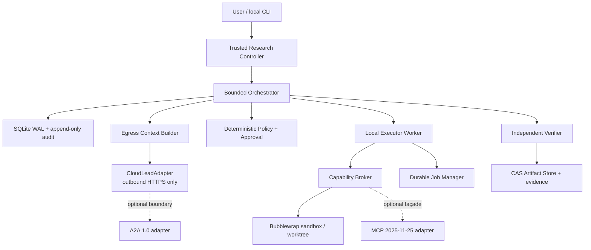

# Final V1 Architecture

The controller is the only component allowed to mutate workflow state, grant capabilities, bind approvals, classify/egress data, invoke verification, and declare acceptance. Cloud and local models produce proposals/claims only. A2A and MCP are removable boundary adapters; their IDs and statuses never replace ResearchRun, WorkOrder, Attempt, Job, or Approval records.
